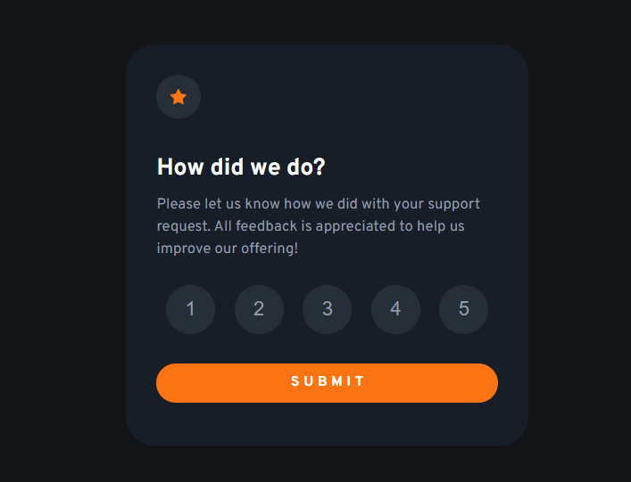
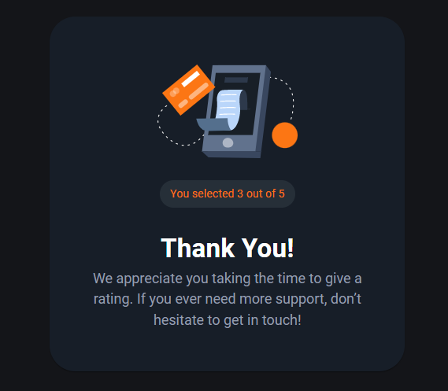

# Frontend Mentor - Interactive rating component solution

This is a solution to the [Interactive rating component challenge on Frontend Mentor](https://www.frontendmentor.io/challenges/interactive-rating-component-koxpeBUmI). Frontend Mentor challenges help you improve your coding skills by building realistic projects.

## Table of contents

- [Overview](#overview)
  - [The challenge](#the-challenge)
  - [Screenshot](#screenshot)
  - [Links](#links)
- [My process](#my-process)
  - [Built with](#built-with)
  - [Useful resources](#useful-resources)
- [Author](#author)

## Overview

### The challenge

Users should be able to:

- View the optimal layout for the app depending on their device's screen size
- See hover states for all interactive elements on the page
- Select and submit a number rating
- See the "Thank you" card state after submitting a rating

### Screenshot

### Links

- Solution URL: [Solution URL here](https://github.com/ArteiusWorkshop/FM-interactive-rating-component)
- Live Site URL: [Live site URL here](https://fm-interactive-rating-component-ql3l17wjw-arteiusworkshop.vercel.app/)

## My process

### Built with

- [React](https://reactjs.org/) - JS library
- [Next.js](https://nextjs.org/) - React framework
- [React Transition Group](https://reactcommunity.org/react-transition-group/) - For transition
- CSS custom properties

### Continued development

### Useful resources

- [CSSTransition](https://reactcommunity.org/react-transition-group/css-transition) - This helped me to implement the component transition when rated.

## Author

- Frontend Mentor - [@ArteiusWasTaken](https://www.frontendmentor.io/profile/ArteiusWasTaken)
